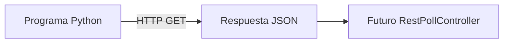

# Laboratorio 1: sensor REST simulado

## Objetivo

Ejecutar una API local que produzca mediciones variables de temperatura y CO₂,
sin necesitar sensores físicos ni instalar paquetes adicionales.

## Qué vamos a construir



En esta primera parte llegaremos hasta la respuesta JSON. La conexión con
BIMROCKET será el siguiente laboratorio.

## 1. Iniciar el sensor

Desde la raíz del repositorio:

```powershell
cd examples\mock-sensor
python server.py
```

El terminal mostrará:

```text
Sensor disponible en http://127.0.0.1:8001/api/rooms/A-101
Pulsa Ctrl+C para detenerlo.
```

El servidor escucha exclusivamente en `127.0.0.1`: solo es accesible desde el
propio equipo.

## 2. Consultar la lectura

Abre otro terminal y ejecuta:

```powershell
Invoke-RestMethod http://127.0.0.1:8001/api/rooms/A-101
```

También puedes abrir esa dirección en el navegador. La respuesta tendrá esta
estructura:

```json
{
  "room": "A-101",
  "ifcGlobalId": "DEMO_IFC_GLOBAL_ID_A101",
  "temperature": 24.3,
  "co2": 1030,
  "timestamp": "2026-06-24T19:00:00+00:00",
  "status": "online"
}
```

Repite la consulta varias veces. `temperature`, `co2` y `timestamp` cambiarán.

## 3. Simular una desconexión

```powershell
Invoke-RestMethod "http://127.0.0.1:8001/api/rooms/A-101?offline=1"
```

La medición mantiene su estructura, pero devuelve:

```json
{
  "status": "offline"
}
```

Esto nos permitirá comprobar posteriormente que BIMROCKET no representa un
valor obsoleto como si fuera válido.

## 4. Comprobar la salud del servicio

```powershell
Invoke-RestMethod http://127.0.0.1:8001/health
```

Resultado esperado:

```json
{
  "status": "ok"
}
```

## Qué está ocurriendo

- `ThreadingHTTPServer` recibe las peticiones HTTP.
- `SensorHandler` decide qué responder según la ruta.
- `build_reading` genera valores que varían suavemente con el tiempo.
- `json.dumps` transforma el objeto de Python en JSON.
- La cabecera CORS permitirá que BIMROCKET consulte el servidor desde el
  navegador.

## Comprobación de comprensión

1. ¿Qué diferencia hay entre `/health` y `/api/rooms/A-101`?
2. ¿Por qué el servidor utiliza el puerto 8001 y no el 8000?
3. ¿Qué campo indica si la medición puede considerarse disponible?
4. ¿Qué valores cambian al repetir la consulta?

## Detener el sensor

Vuelve al terminal del servidor y pulsa `Ctrl+C`.

## Punto de reanudación: 24 de junio de 2026

Se completó el siguiente recorrido práctico:

- El sensor REST respondió con temperatura, CO₂, fecha y estado.
- Se comprobó la diferencia entre `online` y `offline`.
- BIMROCKET se ejecutó localmente en `http://127.0.0.1:8000/app.html`.
- Se creó una caja y se renombró como `Sala_A-101`.
- Se añadió un `RestPollController` con nombre automático `ctr_0`.
- Se conectó correctamente con
  `http://127.0.0.1:8001/api/rooms/A-101`.
- `output` y `jsonOutput` comenzaron a recibir las lecturas.

### Detalles de interfaz aprendidos

- Los cambios de texto o números se confirman pulsando `Enter`.
- Si el nombre del controlador se deja vacío, BIMROCKET genera `ctr_0`.
- `started` es un indicador de solo lectura.
- Para iniciar un controlador individual se utiliza el menú contextual de su
  encabezado, no el de una propiedad.

### Cómo continuar

1. Iniciar el sensor:

   ```powershell
   cd C:\Users\josez\bimrocket-iot-learning\examples\mock-sensor
   python server.py
   ```

2. Iniciar BIMROCKET:

   ```powershell
   cd C:\Users\josez\bimrocket\bimrocket-webapp\src\main\webapp
   python -m http.server 8000 --bind 127.0.0.1
   ```

3. Abrir `http://127.0.0.1:8000/app.html` y cargar, si se guardó, el archivo
   `lab-01-sensor-rest.brf`.

4. Añadir un `DisplayController` cuya entrada proceda de:

   ```javascript
   object.controllers.ctr_0.jsonOutput.co2
   ```

## Punto de reanudación: 25 de junio de 2026

Se completó la conexión entre el `RestPollController` y un
`DisplayController`.

Controladores usados:

```text
ctr_0 = RestPollController
ctr_1 = DisplayController
```

Fórmulas creadas:

```text
controllers.ctr_1.input
```

```javascript
object.controllers.ctr_0.jsonOutput.co2
```

```text
controllers.ctr_1.units
```

```javascript
"ppm"
```

```text
controllers.ctr_1.decimals
```

```javascript
0
```

Aprendizaje importante:

- el menú contextual de fórmulas debe abrirse dentro del panel inferior del
  inspector;
- `path` es la propiedad destino;
- `expression` es el valor o cálculo de origen;
- `RestPollController` guarda el JSON parseado en `jsonOutput`;
- `DisplayController` muestra el valor que recibe en `input`;
- puede ser necesario pulsar `Reconstruir` para evaluar todas las fórmulas.

Resultado conseguido:

```text
Panel visual mostrando el CO₂ de la sala en ppm.
```

El siguiente paso será usar el CO₂ para colorear la sala con un
`ColorController`.

## Modelos guardados

Los modelos `.brf` de este laboratorio están disponibles en el repositorio:

```text
examples/bimrocket-models/lab-01-sensor-rest.brf
examples/bimrocket-models/lab-01-co2-display-color-offline.brf
```

El primero contiene el estado base con `RestPollController`. El segundo contiene
la versión completa con `DisplayController`, `ColorController` y lógica de
estado `offline`.
