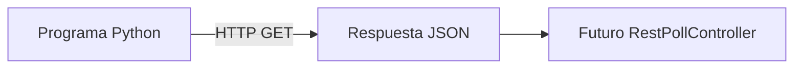

# Laboratorio 1: sensor REST simulado

## Objetivo

Ejecutar una API local que produzca mediciones variables de temperatura y CO₂,
sin necesitar sensores físicos ni instalar paquetes adicionales.

## Qué vamos a construir



En esta primera parte llegaremos hasta la respuesta JSON. La conexión con
BIMROCKET será el siguiente laboratorio.

## 1. Iniciar el sensor

Desde la raíz del repositorio:

```powershell
cd examples\mock-sensor
python server.py
```

El terminal mostrará:

```text
Sensor disponible en http://127.0.0.1:8001/api/rooms/A-101
Pulsa Ctrl+C para detenerlo.
```

El servidor escucha exclusivamente en `127.0.0.1`: solo es accesible desde el
propio equipo.

## 2. Consultar la lectura

Abre otro terminal y ejecuta:

```powershell
Invoke-RestMethod http://127.0.0.1:8001/api/rooms/A-101
```

También puedes abrir esa dirección en el navegador. La respuesta tendrá esta
estructura:

```json
{
  "room": "A-101",
  "ifcGlobalId": "DEMO_IFC_GLOBAL_ID_A101",
  "temperature": 24.3,
  "co2": 1030,
  "timestamp": "2026-06-24T19:00:00+00:00",
  "status": "online"
}
```

Repite la consulta varias veces. `temperature`, `co2` y `timestamp` cambiarán.

## 3. Simular una desconexión

```powershell
Invoke-RestMethod "http://127.0.0.1:8001/api/rooms/A-101?offline=1"
```

La medición mantiene su estructura, pero devuelve:

```json
{
  "status": "offline"
}
```

Esto nos permitirá comprobar posteriormente que BIMROCKET no representa un
valor obsoleto como si fuera válido.

## 4. Comprobar la salud del servicio

```powershell
Invoke-RestMethod http://127.0.0.1:8001/health
```

Resultado esperado:

```json
{
  "status": "ok"
}
```

## Qué está ocurriendo

- `ThreadingHTTPServer` recibe las peticiones HTTP.
- `SensorHandler` decide qué responder según la ruta.
- `build_reading` genera valores que varían suavemente con el tiempo.
- `json.dumps` transforma el objeto de Python en JSON.
- La cabecera CORS permitirá que BIMROCKET consulte el servidor desde el
  navegador.

## Comprobación de comprensión

1. ¿Qué diferencia hay entre `/health` y `/api/rooms/A-101`?
2. ¿Por qué el servidor utiliza el puerto 8001 y no el 8000?
3. ¿Qué campo indica si la medición puede considerarse disponible?
4. ¿Qué valores cambian al repetir la consulta?

## Detener el sensor

Vuelve al terminal del servidor y pulsa `Ctrl+C`.

