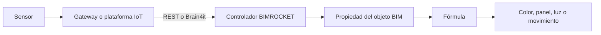

# BIMROCKET e IoT para edificación

Esta base de conocimiento estudia cómo BIMROCKET conecta un modelo digital de
un edificio con datos procedentes de sensores, plataformas IoT y servicios web.

## Objetivo

Llegar a construir una integración comprensible y reproducible donde un dato
real pueda:

1. entrar en BIMROCKET;
2. vincularse con un objeto IFC;
3. modificar su representación visual;
4. provocar una acción controlada en un sistema externo.

## Idea central

!!! note "Cómo utilizar esta documentación"
    Sigue el [itinerario](roadmap.md), realiza los laboratorios y utiliza el
    buscador o el [glosario](glossary.md) cuando necesites recuperar un concepto.

!!! tip "Retomar el curso desde otro equipo"
    Empieza por [Continuar en otro equipo](00-empezar/continuar-en-otro-equipo.md)
    y consulta el [estado actual](progreso/estado-actual.md) para saber
    exactamente por dónde seguir.

## Estado actual

- [x] Estructura inicial de la documentación.
- [x] Mapa conceptual de la integración IoT.
- [x] Lección 1 preparada.
- [x] Primer sensor REST simulado.
- [ ] Modelo IFC conectado.
- [ ] Integración bidireccional con Brain4it.
