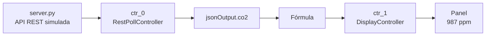
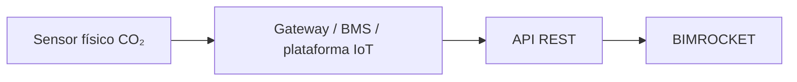
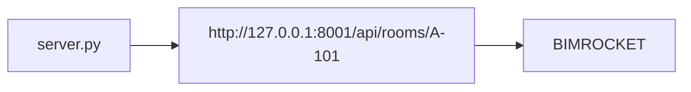

# 2026-06-25 — RestPollController, fórmulas y DisplayController

## Resumen de la sesión

En esta sesión conectamos el dato de CO₂ recibido desde el sensor REST simulado
con un panel visual dentro de BIMROCKET.

El flujo logrado fue:



## Qué simula el sensor

El archivo:

```text
examples/mock-sensor/server.py
```

simula una API IoT local. No tenemos todavía un sensor físico real, así que
este programa hace de sustituto.

En un edificio real podríamos tener:



En el laboratorio lo simplificamos así:



La API devuelve una lectura con esta forma:

```json
{
  "room": "A-101",
  "ifcGlobalId": "DEMO_IFC_GLOBAL_ID_A101",
  "temperature": 24.3,
  "co2": 987,
  "timestamp": "2026-06-25T17:49:37+00:00",
  "status": "online"
}
```

Los valores cambian porque `server.py` genera una lectura nueva cada vez que
BIMROCKET consulta la URL.

## Qué es RestPollController

`RestPollController` es el controlador de BIMROCKET que consulta una URL REST
de forma repetida.

Descomposición del nombre:

- `REST`: una URL HTTP que devuelve datos estructurados.
- `Poll`: consultar periódicamente, una y otra vez.
- `Controller`: componente añadido a un objeto BIM para darle comportamiento.

En nuestro modelo:

```text
ctr_0 = RestPollController
```

Su trabajo es:

```text
cada 10 segundos
↓
hacer GET a http://127.0.0.1:8001/api/rooms/A-101
↓
recibir JSON
↓
guardar la respuesta en output
↓
guardar la respuesta parseada en jsonOutput
```

Propiedades importantes:

| Propiedad | Significado |
| --- | --- |
| `url` | Dirección REST que consulta. |
| `method` | Método HTTP; en el laboratorio usamos `GET`. |
| `pollInterval` | Cada cuántos segundos consulta la URL. |
| `output` | Respuesta recibida como texto. |
| `jsonOutput` | Respuesta JSON convertida en datos consultables. |
| `started` | Indica si el controlador está arrancado; es de solo lectura. |
| `autoStart` | Permite que el controlador arranque al cargar el modelo. |

## Output frente a jsonOutput

Si la API devuelve:

```json
{
  "co2": 987,
  "temperature": 24.3
}
```

Entonces `output` contiene el texto completo:

```text
{"co2":987,"temperature":24.3}
```

Pero `jsonOutput` permite entrar directamente en cada campo:

```javascript
object.controllers.ctr_0.jsonOutput.co2
object.controllers.ctr_0.jsonOutput.temperature
```

Para fórmulas es más cómodo usar `jsonOutput`, porque podemos tomar un dato
concreto sin procesar todo el texto.

## Conceptos base de las fórmulas

Una fórmula en BIMROCKET tiene dos partes:

```text
path
expression
```

La idea mental es:

```text
path       = dónde quiero poner el resultado
expression = de dónde saco o cómo calculo el valor
```

O, en lenguaje cotidiano:

```text
pon este valor aquí
```

## Qué significa object

En una fórmula, `object` representa el objeto BIM donde vive la fórmula.

En el laboratorio:

```text
object = Sala_A-101
```

Ese objeto contiene controladores:

```text
Sala_A-101
└─ controllers
   ├─ ctr_0
   └─ ctr_1
```

## Qué significa el punto `.`

El punto significa “entra dentro de”.

Por ejemplo:

```javascript
object.controllers.ctr_0.jsonOutput.co2
```

se lee así:

```text
entra en object
entra en controllers
entra en ctr_0
entra en jsonOutput
toma co2
```

Es parecido a una dirección:

```text
Sala_A-101 / controladores / ctr_0 / jsonOutput / co2
```

## Fórmula principal creada

Creamos esta fórmula:

```text
path:
controllers.ctr_1.input
```

```javascript
expression:
object.controllers.ctr_0.jsonOutput.co2
```

Traducción:

```text
pon en el input del DisplayController
el CO₂ recibido por el RestPollController
```

Internamente equivale a:

```javascript
object.controllers.ctr_1.input =
  object.controllers.ctr_0.jsonOutput.co2
```

## Por qué path no empieza por object

En `path` escribimos:

```text
controllers.ctr_1.input
```

y no:

```text
object.controllers.ctr_1.input
```

porque `path` ya se interpreta como una ruta dentro del objeto actual.

En cambio, `expression` sí usa `object` porque es una expresión JavaScript que
calcula el valor:

```javascript
object.controllers.ctr_0.jsonOutput.co2
```

## Texto, números y comillas

En las expresiones:

- los números van sin comillas;
- los textos van con comillas.

Ejemplos:

```javascript
0
987
24.3
```

```javascript
"ppm"
"online"
"CO₂ sala A-101"
```

Por eso creamos estas fórmulas auxiliares:

```text
path:
controllers.ctr_1.units
```

```javascript
expression:
"ppm"
```

y:

```text
path:
controllers.ctr_1.decimals
```

```javascript
expression:
0
```

## Qué es DisplayController

`DisplayController` es un controlador visual.

En nuestro modelo:

```text
ctr_1 = DisplayController
```

Muestra en un panel el valor de su propiedad:

```text
input
```

Si:

```text
input = 987
units = ppm
decimals = 0
```

entonces el panel muestra:

```text
987 ppm
```

## Trampa importante descubierta

BIMROCKET no recalcula todas las fórmulas continuamente como una hoja de
cálculo.

Cuando `ctr_0` recibe un nuevo dato, puede actualizar fórmulas relacionadas con
su propia ruta, pero no necesariamente todas las fórmulas del objeto.

Por eso, después de crear la fórmula:

```text
controllers.ctr_1.input =
object.controllers.ctr_0.jsonOutput.co2
```

tuvimos que pulsar:

```text
Reconstruir
```

Ese botón ejecuta una evaluación global de fórmulas mediante
`evaluateFormulas()`.

Después de reconstruir, `ctr_1.input` recibió el valor de CO₂ correctamente.

## Resultado conseguido

Resultado visual:

```text
987 ppm
```

Interpretación:

```text
server.py simula el sensor
RestPollController recoge la lectura
jsonOutput.co2 extrae el valor de CO₂
la fórmula copia ese valor a DisplayController
DisplayController lo muestra como ppm
```

## Frase para recordar

```text
RestPollController trae datos desde fuera;
las fórmulas los conectan con propiedades internas;
DisplayController los muestra al usuario.
```

## Próximo paso

El siguiente paso será usar el valor de CO₂ para cambiar el color de la sala.

Idea:

```text
CO₂ bajo     → verde
CO₂ medio    → amarillo
CO₂ alto     → rojo
sensor offline → estado desconocido
```

