<!-- _class: hero -->
<!-- _paginate: false -->

<div class="brand">BIM Ingenieros · BIMROCKET + IoT</div>

# Lección 1  
Del sensor REST al objeto BIM conectado

<p class="subtitle">Cómo llevar una medición IoT simulada hasta una sala BIM que muestra, colorea y valida el dato.</p>

---

<!-- _class: section-title -->

# Objetivo de la lección

Entender el primer flujo completo:

```text
sensor/API → dato JSON → objeto BIM → visualización → validación
```

---

# Qué vas a construir

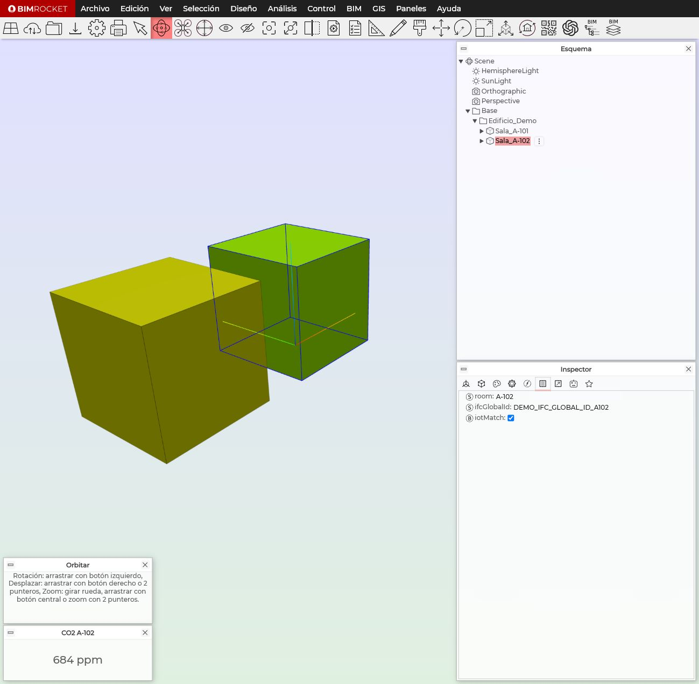

- Una API REST simulada con varias salas.
- Dos objetos BIM: `Sala_A-101` y `Sala_A-102`.
- Un panel de CO₂ por sala.
- Color automático según CO₂, sensor offline o identidad incorrecta.

---

# El sensor devuelve JSON

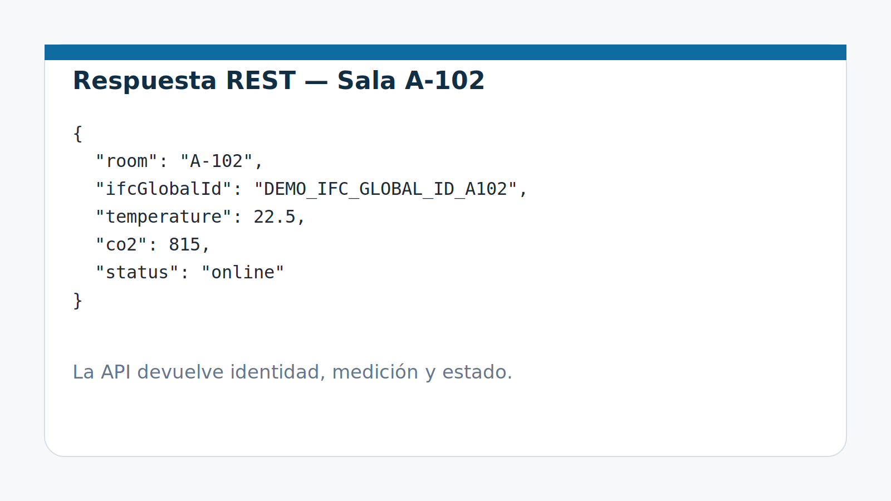

Este JSON es la “lectura viva” que BIMROCKET va a consumir.

---

# Camino del dato

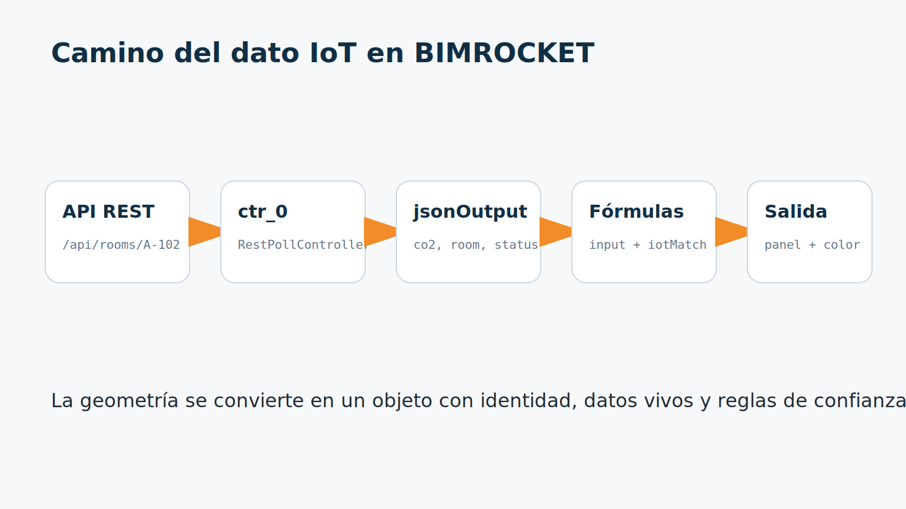

---

<!-- _class: section-title -->

# Identidad BIM + IoT

La clave no es solo leer datos.  
La clave es saber **a qué objeto BIM pertenecen**.

---

# A-101: el objeto sabe quién es

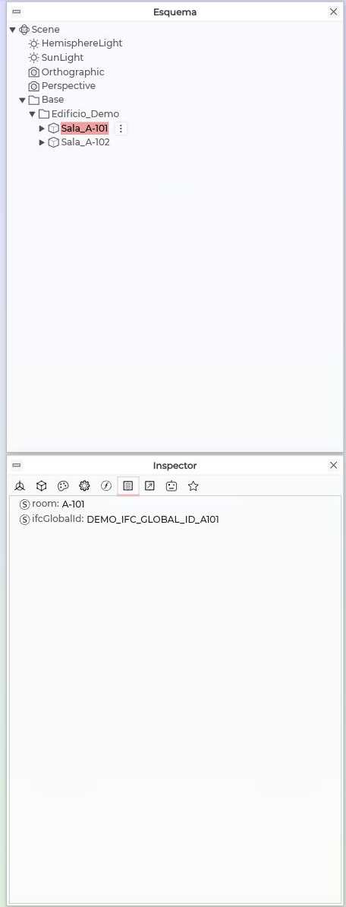

En el esquema está seleccionada `Sala_A-101`.

En el inspector, pestaña de propiedades, vemos:

```text
room = A-101
ifcGlobalId = DEMO_IFC_GLOBAL_ID_A101
```

Ese `room` será el identificador usado para pedir datos a la API.

---

# A-102: misma lógica, otro objeto

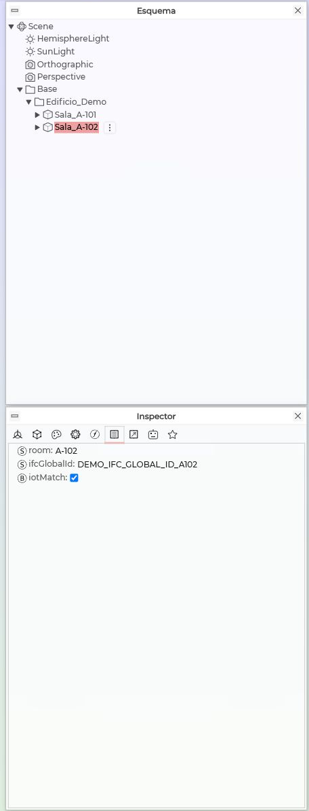

Ahora está seleccionada `Sala_A-102`.

La estructura es la misma, pero los valores cambian:

```text
room = A-102
ifcGlobalId = DEMO_IFC_GLOBAL_ID_A102
```

Esto permite reutilizar reglas sin duplicar lógica a mano.

---

<!-- _class: section-title -->

# Leer datos desde la API

BIMROCKET pregunta cada cierto tiempo a una URL y recibe la respuesta JSON.

---

# RestPollController en A-101

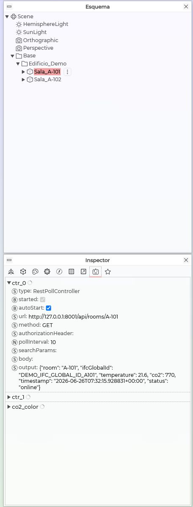

En `Sala_A-101`, el controlador REST consulta:

```text
http://127.0.0.1:8001/api/rooms/A-101
```

El campo `output` muestra la respuesta recibida:

```text
room, ifcGlobalId, temperature, co2, timestamp, status
```

---

# RestPollController en A-102

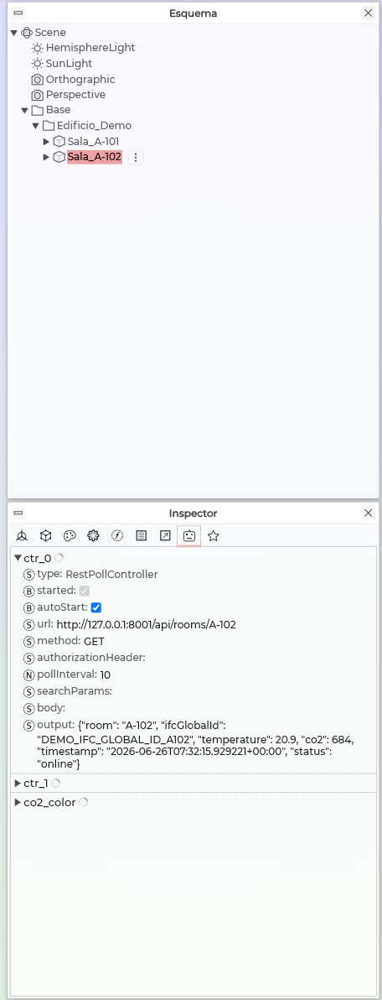

En `Sala_A-102`, el mismo controlador consulta:

```text
http://127.0.0.1:8001/api/rooms/A-102
```

La idea importante:

> cada objeto BIM pregunta por su propio dato.

---

# URL dinámica del sensor

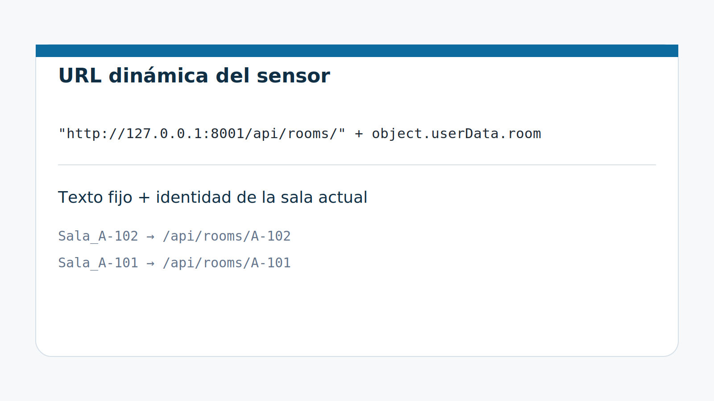

La fórmula une texto fijo con la sala actual:

```javascript
"http://127.0.0.1:8001/api/rooms/" + object.userData.room
```

---

# Fórmula en BIMROCKET

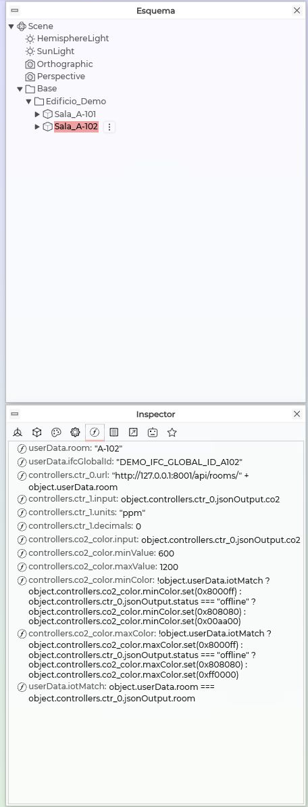

Aquí está seleccionada `Sala_A-102` y está abierta la pestaña de Fórmulas.

La URL no está escrita como `A-102` fijo.

Usa:

```javascript
object.userData.room
```

La misma fórmula sirve para `A-101` y `A-102`.

---

<!-- _class: section-title -->

# Mostrar el CO₂

Leer el dato no basta.  
Tenemos que convertirlo en información visible para el usuario.

---

# Fórmula para mostrar CO₂

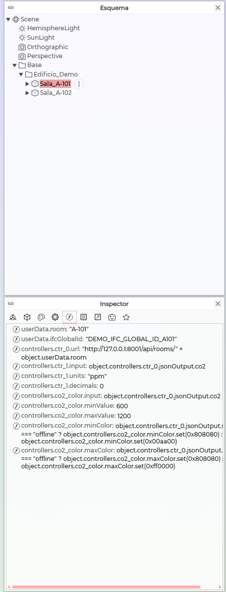

En `Sala_A-101`, el `DisplayController` toma el CO₂ del JSON:

```javascript
object.controllers.ctr_0.jsonOutput.co2
```

Traducción:

> del resultado recibido por REST, usa el campo `co2`.

---

# Resultado visible

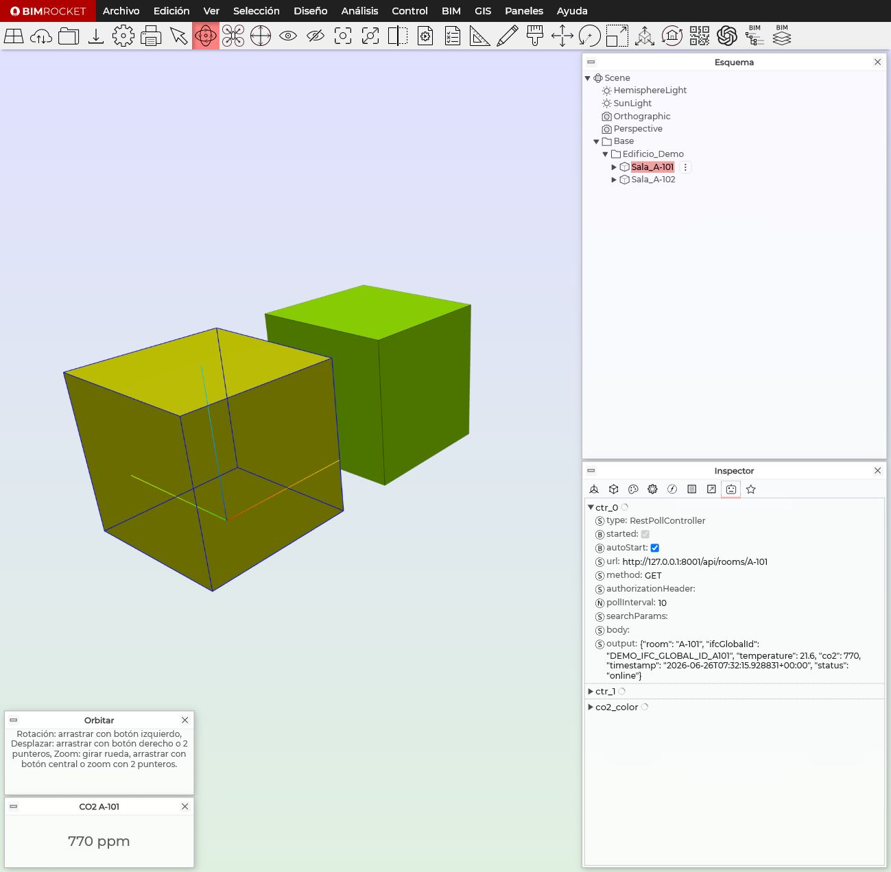

El panel inferior muestra:

```text
CO2 A-101
770 ppm
```

La sala ya no es solo geometría: ahora enseña un dato vivo.

---

<!-- _class: section-title -->

# Validar confianza del dato

Un dato puede llegar, pero no pertenecer al objeto correcto.

---

# iotMatch

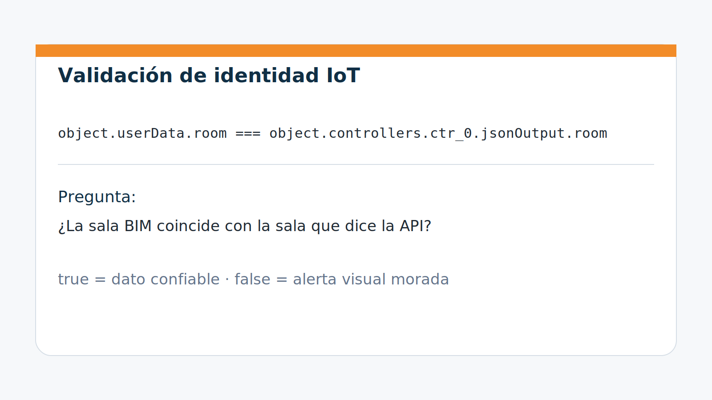

`iotMatch` responde a una pregunta muy concreta:

> ¿la sala del objeto coincide con la sala que viene en el JSON?

---

# iotMatch en A-102


En la pestaña de Fórmulas se ve la comparación:

```javascript
object.userData.room === object.controllers.ctr_0.jsonOutput.room
```

Si ambas partes coinciden, el dato es confiable para esa sala.

---

# Estados visuales

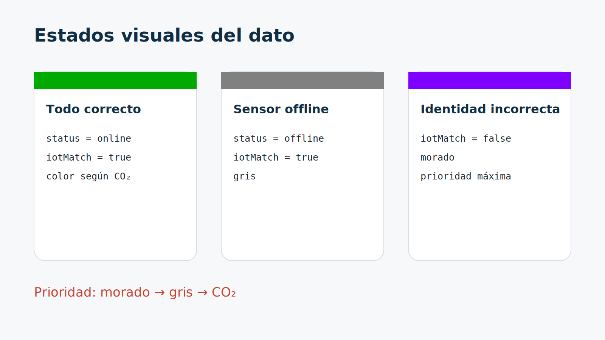

La sala no solo muestra valores.  
También comunica estado y confianza mediante color.

---

# Reglas finales de color

Para `minColor`:

```javascript
!object.userData.iotMatch
  ? object.controllers.co2_color.minColor.set(0x8000ff)
  : object.controllers.ctr_0.jsonOutput.status === "offline"
    ? object.controllers.co2_color.minColor.set(0x808080)
    : object.controllers.co2_color.minColor.set(0x00aa00)
```

---

# Prioridad de confianza

| Prioridad | Condición | Color | Significado |
|---:|---|---|---|
| 1 | `iotMatch = false` | Morado | Dato no confiable |
| 2 | `status = offline` | Gris | Sensor no disponible |
| 3 | Todo correcto | Verde-rojo | CO₂ válido |

---

<!-- _class: section-title -->

# Pruebas realizadas

No basta con configurar.  
Hay que probar cada estado.

---

# Prueba 1 — Caso normal


En el controlador REST vemos:

```text
status = online
room = A-102
```

Resultado:

```text
iotMatch = true
color = según CO₂
```

---

# Prueba 2 — Sensor offline

URL temporal usada:

```javascript
"http://127.0.0.1:8001/api/rooms/" + object.userData.room + "?offline=1"
```

Resultado esperado:

```text
status = offline
iotMatch = true
color = gris
```

Esta prueba comprueba disponibilidad del sensor.

---

# Prueba 3 — Identidad incorrecta

Fórmula temporal usada:

```javascript
"A-999" === object.controllers.ctr_0.jsonOutput.room
```

Resultado esperado:

```text
iotMatch = false
color = morado
```

Esta prueba comprueba confianza del dato.

---

# Modelo final

Archivo de referencia:

```text
examples/bimrocket-models/lab-03-dos-salas-iot.brf
```

Contiene:

- dos salas conectadas;
- URL dinámica;
- paneles de CO₂;
- validación `iotMatch`;
- estados visuales de confianza.

---

# Cierre conceptual

```text
Un gemelo digital no es solo un modelo 3D.
Es geometría + identidad + datos vivos + reglas de confianza.
```

---

<!-- _class: hero -->
<!-- _paginate: false -->

<div class="brand">BIM Ingenieros</div>

# Siguiente paso

Del sensor simulado al sensor real con ESP32.

<p class="subtitle">La lógica aprendida se mantiene. Solo cambia la fuente del dato.</p>
