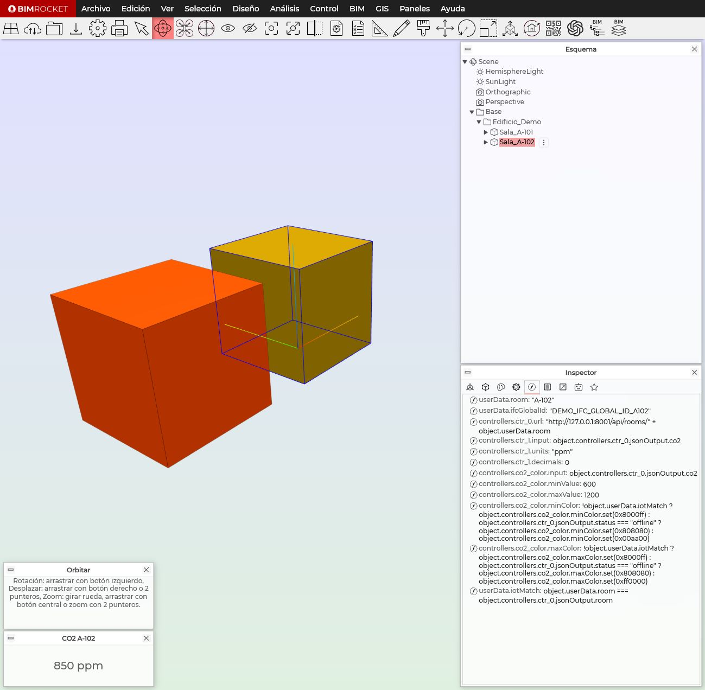
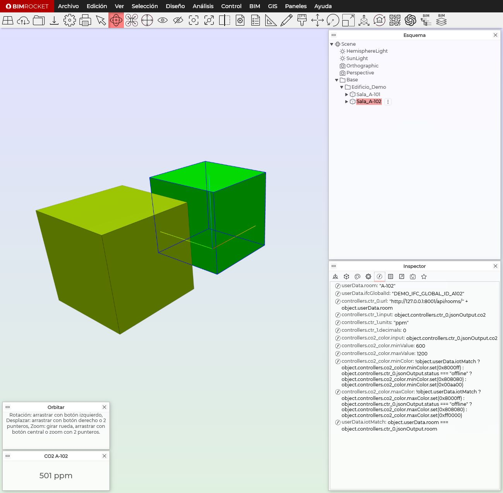
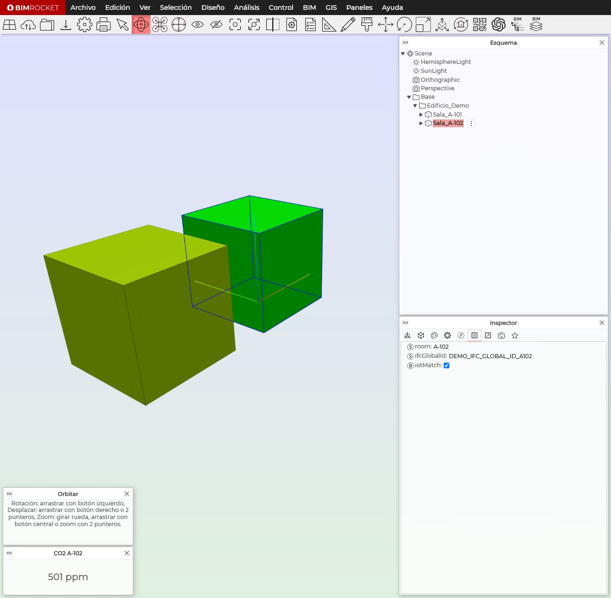

<!-- _class: hero -->
<!-- _paginate: false -->

<div class="brand">BIM Ingenieros · BIMROCKET + IoT</div>

# Lección 1  
Del sensor REST al objeto BIM conectado

<p class="subtitle">Cómo llevar una medición IoT simulada hasta una sala BIM que muestra, colorea y valida el dato.</p>

---

<!-- _class: section-title -->

# Objetivo de la lección

Entender el primer flujo completo:

```text
sensor/API → dato JSON → objeto BIM → visualización → validación
```

---

# Qué vas a construir



- API REST simulada con varias salas.
- Modelo BIMROCKET con `Sala_A-101` y `Sala_A-102`.
- Panel de CO₂ por sala.
- Color por CO₂, offline e identidad incorrecta.

---

# El sensor devuelve JSON


---

# Camino del dato


---

<!-- _class: section-title -->

# Identidad BIM + IoT

La clave no es solo leer datos.  
La clave es saber **a qué objeto BIM pertenecen**.

---

# Cada sala sabe quién es

```text
Sala_A-102
├── userData.room = A-102
└── userData.ifcGlobalId = DEMO_IFC_GLOBAL_ID_A102
```

`room` identifica la sala para la API.  
`ifcGlobalId` representa el identificador BIM/IFC.

---

# URL dinámica del sensor


---

# Fórmula para mostrar CO₂

Path:

```text
controllers.ctr_1.input
```

Expression:

```javascript
object.controllers.ctr_0.jsonOutput.co2
```

El `DisplayController` muestra el CO₂ recibido por `RestPollController`.

---

# En BIMROCKET: fórmulas



---

<!-- _class: section-title -->

# Validar confianza del dato

Un dato puede llegar, pero no pertenecer al objeto correcto.

---

# iotMatch


---

# En BIMROCKET: userData



---

# Estados visuales


---

# Reglas finales de color

Para `minColor`:

```javascript
!object.userData.iotMatch
  ? object.controllers.co2_color.minColor.set(0x8000ff)
  : object.controllers.ctr_0.jsonOutput.status === "offline"
    ? object.controllers.co2_color.minColor.set(0x808080)
    : object.controllers.co2_color.minColor.set(0x00aa00)
```

---

# Prioridad de confianza

| Prioridad | Condición | Color | Significado |
|---:|---|---|---|
| 1 | `iotMatch = false` | Morado | Dato no confiable |
| 2 | `status = offline` | Gris | Sensor no disponible |
| 3 | Todo correcto | Verde-rojo | CO₂ válido |

---

<!-- _class: section-title -->

# Pruebas realizadas

No basta con configurar.  
Hay que probar cada estado.

---

# Prueba 1 — Caso normal

```text
status = online
iotMatch = true
color = según CO₂
```

Resultado: la sala usa la escala verde → rojo.

---

# Prueba 2 — Sensor offline

URL temporal:

```javascript
"http://127.0.0.1:8001/api/rooms/" + object.userData.room + "?offline=1"
```

Resultado esperado:

```text
status = offline
iotMatch = true
color = gris
```

---

# Prueba 3 — Identidad incorrecta

Fórmula temporal:

```javascript
"A-999" === object.controllers.ctr_0.jsonOutput.room
```

Resultado esperado:

```text
iotMatch = false
color = morado
```

---

# Modelo final

Archivo de referencia:

```text
examples/bimrocket-models/lab-03-dos-salas-iot.brf
```

Contiene:

- dos salas conectadas;
- URL dinámica;
- paneles de CO₂;
- validación `iotMatch`;
- estados visuales de confianza.

---

# Cierre conceptual

```text
Un gemelo digital no es solo un modelo 3D.
Es geometría + identidad + datos vivos + reglas de confianza.
```

---

<!-- _class: hero -->
<!-- _paginate: false -->

<div class="brand">BIM Ingenieros</div>

# Siguiente paso

Del sensor simulado al sensor real con ESP32.

<p class="subtitle">La lógica aprendida se mantiene. Solo cambia la fuente del dato.</p>
